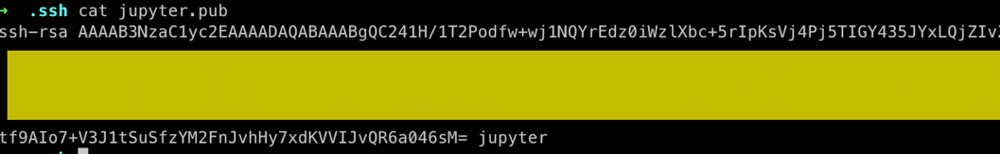
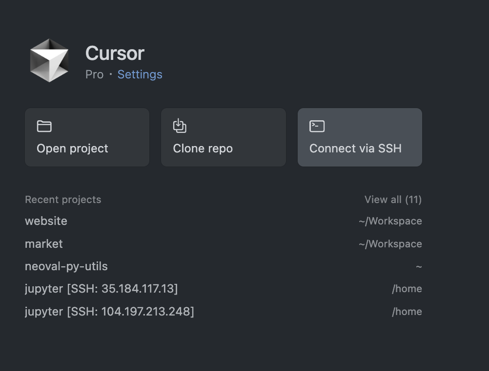
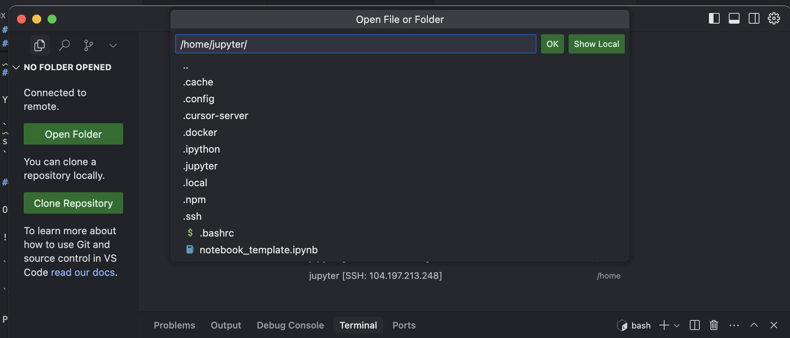
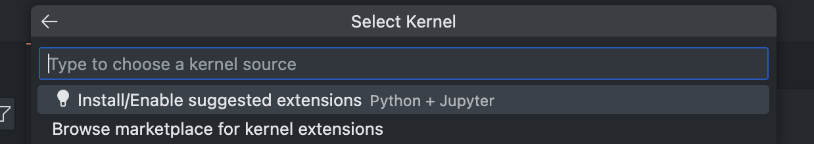
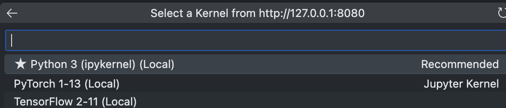

April 2025

# How to open a Vertex AI Workbench Jupyter notebook in Cursor(VS Code)


Welcome to this guide on how to open a Vertex AI Workbench Jupyter notebook using Cursor, which also works with VS Code. If you're a fan of coding in Cursor like I am, you're in the right place!

## Prerequisites

Before we start, make sure you have the following installed on your local machine:

- Cursor (version 0.48.9+) or VSCode (version 1.96.2+)
- gcloud CLI

## 1. Create a User Managed Notebook

If you already have a Vertex AI Workbench Notebook, feel free to skip this step.

1. Go to [GCP Workbench](https://console.cloud.google.com/vertex-ai/workbench/instances) and click on `Create new`.
2. Choose your machine type based on your needs (e.g., GPU, memory, cores).
3. Set up IAM and security based on what you need to access. Consider using a service account for cross-project access.

## 2. Add SSH Key to User Managed Notebook

### Create SSH key

1. Open your terminal and run the following command to create an SSH key:

```bash
ssh-keygen -t rsa -f ~/.ssh/jupyter
```

2. Open the public key in a text editor. Change the username at the end to jupyter to ensure access to files created in the UI.



### Add ssh key

1. Use the gcloud command line tool to add your SSH key:

Example:
```
gcloud workbench instances update zyrah-notebook --metadata=ssh-keys="jupyter:$(cat ~/.ssh/jupyter.pub)" --location=us-central1-a --project neoval-sandbox
```

2. Disable OS login to allow SSH access:

Example:
```
gcloud workbench instances update zyrah-notebook --metadata=enable-oslogin=FALSE --location=us-central1-a --project neoval-sandbox
```

## 3. Promote address to static

If you plan to use your notebook over a long period, it's a good idea to reserve a static IP address. This prevents the IP from changing every time you restart the instance.

1. Go to [VPC Network > IP Addresses](https://console.cloud.google.com/networking/addresses) and select `Promote to static address` on the `external` address for your notebook.
2. Name your IP address. For more details, [check this](https://cloud.google.com/compute/docs/ip-addresses/configure-static-external-ip-address#console)


## 4. Remote SSH into notebook

1. In Curor, open `New Window`

2. Click on `Connect via SSH`



3. Click on `+ Add New SSH Host...`

4. Enter your SSH command

Example:
```
ssh -i /Users/zyrahbernardino/.ssh/jupyter jupyter@<external IP address>
```

5. Will direct you to update `.ssh/config` and automatically populate a New Host.


Update the `Host` label so you can find it later.
```
Host <whatever you want to label>
  HostName <external ip address>
  IdentityFile /Users/zyrahbernardino/.ssh/jupyter
  User jupyter
```

5. Open `Connect via SSH` again and select the host you labeled.

## 5. Set up Jupyter

1. Open folder `/home/jupyter/`


### Install extensions

1. Click on `Select Kernel` in the top right corner.
2. If Jupyter isn't installed, click on `Install/Enable suggested extensions`.

3. Once installed, select `Existing Jupyter Server..`and enter `http://127.0.0.1:8080`.
4. Choose your kernel. Workbench notebooks come with pre-installed options like PyTorch or TensorFlow.


## Final Checks

Before you start, here are some checks to ensure everything is set up correctly:

- BigQuery Access: Test your access by querying a table.

``` python
from google.cloud import bigquery
client = bigquery.Client()
query_job = client.query("SELECT SESSION_USER() as whoami")
result = query_job.result()
for row in result:
    print(row)
```

- GPU + Torch: Verify that your GPU is available.

``` python
import torch
torch.cuda.is_available()
```

## Sources

- <https://medium.com/google-cloud/remote-ssh-into-vertex-ai-user-managed-notebook-with-vscode-using-os-login-ee5e846299c0>
- <https://cloud.google.com/compute/docs/connect/add-ssh-keys>
- <https://cloud.google.com/compute/docs/ip-addresses/configure-static-external-ip-address#console>
